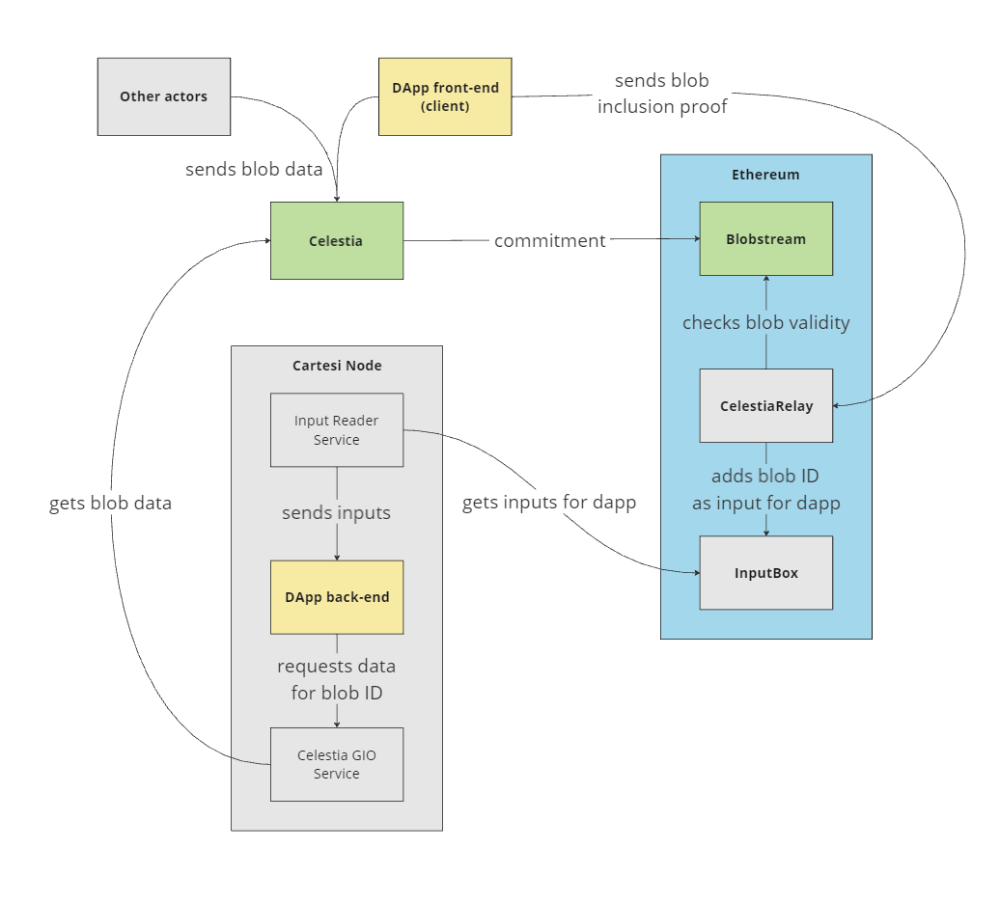

# rollups-celestia

Cartesi Experiment Week #2 project to allow the creation of Cartesi DApps using Celestia as DA

## Rationale

[Celestia](https://celestia.org/) provides a modular data availability (DA) network, which can be of use to store data for layer-2 rollup solutions.
[Cartesi](https://cartesi.io) provides a [rollups solution](https://docs.cartesi.io/cartesi-rollups/) which features very high computational capabilities, and could particularly benefit from having access to more data.

In this experiment, we will implement infrastructure to allow Cartesi DApps to consume arbitrary data posted to Celestia.
The goal is to allow larger volumes of data to be sent to Cartesi applications, since Celestia allows blobs of up to 2MB.

## Architecture

The following diagram summarizes the architecture and general workflow:



1. DApp is deployed to an Ethereum-compatible network for which there is a Blobstream contract receiving Celestia commitments
1. Client submits data (a blob) to Celestia, specifying a namespace associated with the Cartesi DApp's address
1. Alternatively, client can retrieve the reference of a blob previously submitted by other actors
1. Once the blob is included in a Celestia block and that block's commitment is submitted to the `Blobstream` contract, client builds a proof of the blob's inclusion in the commitment
1. Client submits the blob inclusion proof to a `CelestiaRelay` contract on the base layer, with the intent of sending it to the Cartesi DApp's back-end
1. The `CelestiaRelay` contract calls the Celestia `Blobstream` contract to verify the blob inclusion proof against the official Celestia data commitments
1. Once the blob is validated, the `CelestiaRelay` contract calls the Cartesi `InputBox` to add a pointer (ID) to the blob as an input to the Cartesi DApp
1. The Cartesi Node reads the input from the `InputBox` and sends it to be processed by the DApp back-end, as with any other input
1. The DApp back-end recognizes that the input comes from the `CelestiaRelay` contract, which it trusts to only relay IDs of valid Celestia blobs
1. The DApp back-end requests the corresponding blob by using the Generic I/O (GIO) endpoint with the Celestia domain and the blob's ID
1. The `Celestia GIO Service` fetches the specified blob given its ID
1. The DApp back-end receives the data and resumes processing

In the future, on-chain dispute resolution (e.g., using [Dave](https://github.com/cartesi/dave)) will require validators to send a proof that associates a blob ID with the Cartesi merkle tree root hash of its corresponding data. This will probably require using the blob inclusion proof already mentioned above, along with a ZK proof of the merkle root hash computation of the associated data.

## Components

To implement the proposed architecture, the following components were built:

- [CelestiaRelay](./onchain/contracts/CelestiaRelay.sol/): a smart contract for safely relaying Celestia blob IDs as inputs to Cartesi DApps
- [Nonodo dev version for Celestia](https://github.com/Calindra/nonodo/tree/feature/celestia-da): a branch/fork of Nonodo (https://github.com/Calindra/nonodo) with special support for Celestia DA. It includes code for submitting data to Celestia and for building and submitting blob inclusion proofs to the CelestiaRelay contract, along with an implementation of a Celestia GIO service
- [Celestial test app](https://github.com/Calindra/celestial): a test application to exercise usage of Celestia data in a Cartesi DApp

Note: the Nonodo branch/fork and the test application are located in other repositories.

## Notes and known issues

1. This feature is currently only available for DApps running in host mode, since for now the special Nonodo fork/branch is the only node implementation that supports it
1. Any Celestia data can be relayed, there is no restriction to using something originally associated with the DApp.
1. In order to be relayed, Celestia data needs to be covered by the Blobstream commitments stored on-chain. These commitments are not submitted in real time, only periodically. Users should expect to wait at least 1 hour between submitting the data to Celestia and being able to relay it to a DApp.
1. The [SharesProof](https://github.com/celestiaorg/blobstream-contracts/blob/cee4724cca2141beb831391aaef1b7ae97060e3c/src/lib/verifier/DAVerifier.sol#L16) object is currently being used as a blob inclusion proof, but unfortunately it includes the blob data itself (!). This of course completely beats the purpose of the project, which is to allow larger volumes of data to be accessible by Cartesi DApps. On the bright side, studying the Blobstream on-chain verification code, it seems to be perfectly possible to change the proof to include only hashes (or _digests_) of the data instead of the data itself. The on-chain verification procedure implemented by [DAVerifier](https://github.com/celestiaorg/blobstream-contracts/blob/cee4724cca2141beb831391aaef1b7ae97060e3c/src/lib/verifier/DAVerifier.sol#L84) could then be modified to skip the [NamespaceMerkleTree.verifyMulti()](https://github.com/celestiaorg/blobstream-contracts/blob/cee4724cca2141beb831391aaef1b7ae97060e3c/src/lib/tree/namespace/NamespaceMerkleTree.sol#L146) method and instead directly call [NamespaceMerkleTree.verifyMultiHashes()](https://github.com/celestiaorg/blobstream-contracts/blob/cee4724cca2141beb831391aaef1b7ae97060e3c/src/lib/tree/namespace/NamespaceMerkleTree.sol#L167).

## Building and deploying CelestiaRelay

To build and deploy the [CelestiaRelay](./onchain/contracts/CelestiaRelay.sol/) contract, perform the following steps:

1. Ensure git submodules are initialized and updated

```shell
git submodule update --init --recursive
```

2. Build the Blobstream contracts

```shell
cd onchain/blobstream-contracts
npm i
forge build
```

> Note: This step is only necessary when deploying to localhost or to a network where known Blobstream contract deployments are not [defined](./onchain/deploy/01_Blobstream.ts).

3. Install and deploy

```shell
cd onchain
yarn
yarn deploy
```

> Note: this will deploy to all configured networks. You may deploy to individual networks by using specific deployment targets, such as `yarn deploy:sepolia`
